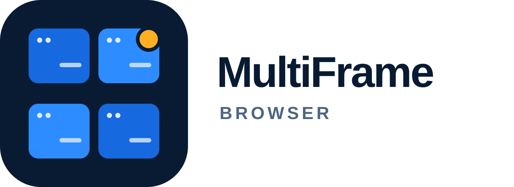

<div align="center">
  
</div>

# MultiFrame Browser

**[multiframe.app](https://multiframe.app)**

Десктопний застосунок для Windows: від 1 до 9 незалежних вебсесій в одному вікні, у сітці до 3×3. Кожен профіль має власне сховище, власний проксі та власний профіль ідентичності пристрою.

**Статус:** етапи 0–5 реалізовано, етап 6 закрито в основному, етап 7 (стабілізація) розпочато.

| Етап | Зміст | Стан |
|---|---|---|
| 0 | Спайк розв'язки viewport | ✓ |
| 1 | Каркас, IPC-контракт, конфігурація, i18n | ✓ |
| 2 | Фрейми, вкладки, помилки, сертифікати | ✓ |
| 3 | Проксі, SOCKS5-relay, оцінка якості | ✓ |
| 4 | Ідентичність, патчі, самоперевірка | ✓ крім geoip-ретаргетингу (Ф-4.6) і canvas-шрифтів (частина Ф-4.7) |
| 5 | Персистентність, бекапи, сховище | ✓ |
| 6 | UX і продуктивність | ✓ крім візуальної оптимізації ресайзу сітки |
| 7 | Стабілізація і реліз | розпочато: наскрізні тести є, авто-оновлення/crash-репорти/підпис коду — ні |

> ⚠️ Проєкт відкритий і перевірюваний навмисно. Застосунок працює з вашими авторизованими сесіями — ви маєте змогу самостійно переконатися, що вони нікуди не передаються.

---

## Документація

| Документ | Зміст |
|---|---|
| [`STATE.md`](STATE.md) | **Стан розробки і передача — почніть звідси** |
| [`ТЗ.md`](ТЗ.md) | Технічне завдання: вимоги, критерії приймання, етапи |
| [`ANALYSIS.md`](ANALYSIS.md) | Аналіз вихідного ТЗ, технічні прогалини, архітектурні рішення |
| [`docs/F-4.5-viewport.md`](docs/F-4.5-viewport.md) | Розв'язка viewport від розміру комірки — найризикованіша вимога |
| [`docs/ACCEPTANCE-MATRIX.md`](docs/ACCEPTANCE-MATRIX.md) | Чесна звірка всіх 44 критеріїв приймання (ТЗ §15) з фактичними доказами |
| [`docs/RECOMMENDATIONS.md`](docs/RECOMMENDATIONS.md) | Рекомендації, що виходять за межі вимог |
| [`docs/PROXY-AFFILIATES.md`](docs/PROXY-AFFILIATES.md) | Партнерські програми проксі-провайдерів |

## Спайки

Перед стартом коду треба закрити гіпотези етапу 0.

```powershell
cd spikes\viewport-scaling
npm install
npm start
```

> У Windows PowerShell 5.1 оператор `&&` не підтримується — команди виконуйте окремими рядками або через `;`.

Опис і критерії — [`spikes/viewport-scaling/README.md`](spikes/viewport-scaling/README.md).

## Перевірки

Працюють без встановлення залежностей і без збірки:

```powershell
npm run verify            # усі шість наборів нижче за раз
npm run verify:addresses  # контрольні суми криптоадрес (Ф-13.21)
npm run verify:i18n       # повнота перекладів у 5 мовах
npm run verify:patches    # регресія шару маскування (Ф-4.5, Ф-4.7, Ф-4.8)
npm run verify:backup     # цикл резервного копіювання профілю
npm run verify:cdp        # захист від CDP-команд до першої навігації
npm run verify:hotkeys    # гарячі клавіші: коди клавіш, конфлікти комбінацій
npm run verify:geoip      # MaxMind: URL завантаження, евристика типу підмережі
npm run typecheck         # обидва проєкти TypeScript
```

Наскрізні тести (Playwright для Electron, справжній запуск застосунку без участі людини):

```powershell
npm run test:e2e     # збірка + весь набір
npx playwright test  # без пересборки, якщо out/ уже свіжий
```

## Стек

Electron + TypeScript + React. `WebContentsView` на окрему сесію для кожного профілю, емуляція параметрів через CDP.

---

## Підтримка

Дублювання адрес із застосунку для незалежної звірки (ТЗ Ф-13.11). **Перед надсиланням звіряйте адресу повністю, а не перші й останні символи** — шкідливе ПЗ підміняє криптоадреси в буфері обміну.

### Розвиток проєкту

| Мережа | Адреса |
|---|---|
| BTC | `bc1q6zwx4q9andwpe08rgdhgu8qj8angt5gf9gws74` |
| ERC-20 | `0x575e6B208aF1b4849Aa3797d29A732442435d669` |
| TRC-20 | `TNCWPQut8f3r2fP56LSiJdBymEANS5TNDZ` |
| SOL | `HMuDVXQq9bhb27LrHUQEHXWLJthvse5UM3rCQBQ4KYNy` |

### Донат на ЗСУ — підрозділи 67 ОМБр

Волонтерський збір проєкту на потреби підрозділів 67-ї окремої механізованої бригади. Це **не** офіційний державний чи благодійний фонд.

Звіт про використання коштів і деталі збору: **[multiframe.app/support-Ukraine](https://multiframe.app/support-Ukraine)**

| Мережа | Адреса |
|---|---|
| BTC | `bc1qy0zcj4n7av6hkkwatf3a7yks60s9yu28zyrj39` |
| ERC-20 | `0x86bbF4E7111958aFd8A863165f0ACeFb5181306e` |
| TRC-20 | `TMjk63TXr1YtXBZq8Vb75FFeYB6C6G9sYx` |
| SOL | `frWSAhDa7Pfq2fYkarfw56WnNqFite7AXNC17R7Z1KQ` |

> **Статус:** домен зареєстровано, наповнення сторінки очікується. До появи діючого звіту розділ «Донат на ЗСУ» не вмикається у релізних складаннях (ТЗ Ф-13.5, Ф-13.22.2).

---

## Ліцензія

Код — [MIT](LICENSE).

Назва «MultiFrame Browser», логотип та іконка (`assets/`) під MIT **не підпадають**. Форки мають використовувати власний брендинг.

## Застереження

Інструмент загального призначення. Використання кількох акаунтів одного сервісу може порушувати умови надання послуг цього сервісу; відповідальність за дотримання ToS — на користувачі.
